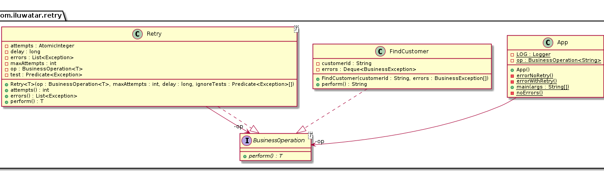

| Title | category   | language | tag                                   |
|-------|------------|----------|---------------------------------------|
| Retry | Behavioral | en       | - Performance<br/>- Cloud distributed |


[ORIGIN LINK in GitHub](https://github.com/iluwatar/java-design-patterns/tree/master/retry)


## Mục đích

Retry một cách minh bạch với các hoạt động liên quan đến giao tiếp với các resource bên ngoài, đặc biệt là 
qua network, isolating calling code khỏi các chi tiết thực hiện retry

## Giải thích

Retry pattern bao gồm các hoạt động retry trên các remote resource thông qua network với một số lần được set trước.
Hoạt động dựa trên yêu cầu của cả business lẫn technical: 
- Business cho phép end user đợi trong bao lâu để các hoạt động retry finishes ?????
- Cân nhắc các đặc điểm performance của hệ thống remote resource khi peak loads cũng như
khả năng thêm thread để đợi xử lý của hệ thống remote resources, đâu là điểm cân bằng ?
- Giữa vô số các case trả về errors của remove service, cái nào có thể bỏ qua nột các an toàn trong các lênh retry ?
- Hoạt động đang retry có phải là [idempotent](https://en.wikipedia.org/wiki/Idempotence) ??? ([vietlink về  thuật ngữ idempotent qua thiết kế REST API](https://viblo.asia/p/mot-so-chia-se-khi-thiet-ke-api-bWrZn6gOZxw))


Một tác động khác cần được cân nhắc đó là tác động của việc thực the cơ chế retry tới `the calling code`.
Cơ chế retry tốt nhất nên hoàn toàn tách bạch với `the calling code` (không ảnh hưởng tới API dịch vụ).
Có 2 cách thường dùng để tiếp cận vấn đề này:
- `chiến lược` : bắt đầu phân tích từ tầm nhìn chiến lược cỡ tập đoàn 
- `chiến thuật`: bắt đầu từ góc nhìn chiến thuật của service 


Lựa chọn tầm nhìn `chiến lược`, cơ chế retry nên được xử lý bởi các request được gửi thẳng đến các system trung gian,
thường được biết đến như môt [Enterprise Service Bus - ESB](https://en.wikipedia.org/wiki/Enterprise_service_bus),
và gần đây là mô hình [Service Mesh](https://medium.com/microservices-in-practice/service-mesh-for-microservices-2953109a3c9a)

Lựa chọn tầm nhìn `chiến thuật`, cơ chế retry nên được xử lý với các reusing-libraries được chia sẻ như 
[Hystrix](https://github.com/Netflix/Hystrix). 

- **NOTE**: Hystrix là một libraries triển khai dựa trên 
[Cỉcuit Breaker pattern](https://java-design-patterns.com/patterns/circuit-breaker/). Retry pattern có thể coi là một nhánh con
của CB pattern.

  
Ví dụ thực tế:
> System sử dụng một service cung cấp thông tin khách hàng. Đôi khi service đó có vấn đề 
> và trả về lỗi hoặc đôi khi timeout. Để xử lý vấn đề này, chúng ta sử dụng retry pattern

Nói một cách đơn giản thì

> Retry pattern xử lý lại các operations lỗi qua network.

[Microsoft documentation](https://docs.microsoft.com/en-us/azure/architecture/patterns/retry) đề cập đến:

> Khi một ứng dụng cố gắng connect tới một service hoặc một network resource mà bị fail, 
> kích hoạt lại các hoạt động retry một cách transparently. Cải thiện tính ổn định của application.

**Ví dụ trong lập trình**

Trong ứng dụng giả định, chúng ta có một interface chung cho tất cả các nghiệp vụ business

```java
public interface BusinessOperation<T> {
  T perform() throws BusinessException;
}
```

Và chúng ta triển khai implementation interface vào `FindCustomer` để tìm thông tin khách trong database

```java
public final class FindCustomer implements BusinessOperation<String> {
  @Override
  public String perform() throws BusinessException {
    ...
  }
}
```


`FindCustomer` được triển khai để raise `BusinessException` trước khi trả ra customer's ID trong trường hợp system
không ổn định và gây lỗi. 

Một số trường hợp khác như `CustomerNotFoundException` ... là có thể được phục hồi bởi
nguyên nhân gốc là lỗi bắt nguồn từ `some database locking issue`. 

Tuy nhiên, lỗi `DatabaseNotAvailableException` nên được cân nhắc như `showstopper` (lỗi làm nhưng hệ thống, người dùng không 
thể tương tác tiếp) - Application không nên cố gắng để phục hồi lỗi này.

Chúng ta có thể lập một kịch bản retry cho `FindCustomer` như sau:

```java
final var op = new FindCustomer(
    "12345",
    new CustomerNotFoundException("not found"),
    new CustomerNotFoundException("still not found"),
    new CustomerNotFoundException("don't give up yet!")
);
```

Trong setup như trên, `FindCustomer` sẽ throw ra `CustomerNotFoundException` 3 lần, 
sau đó sẽ cân nhắc trả ra the customer's ID (`12345`).

Trong trường hợp trên, phân tích thêm chúng tôi thấy hoạt động này thường FAIL khoảng 2-4 lần cho mỗi request
khi hệ thống đạt ngưỡng peal hours, và mỗi worker thead trong hệ thống database thường mất 50ms để `recover from an error`.
Áp điều này vài logic code chúng ta có đoạn triển khai sau:

```java
final var op = new Retry<>(
    new FindCustomer(
        "1235",
        new CustomerNotFoundException("not found"),
        new CustomerNotFoundException("still not found"),
        new CustomerNotFoundException("don't give up yet!")
    ),
    5,
    100,
    e -> CustomerNotFoundException.class.isAssignableFrom(e.getClass())
);
```

Mỗi lần thực thi `op` sẽ tự động trigger nhiều nhất 5 lần retry, với 100 millisecond delay giữ mối lần retry,
bỏ qua bất kì `CustomerNotFoundException` thrown ra trong quá trình thực thi. 
Trong ví dụ trên, có 01 lần thử ban đầu và 03 lần retry thử lại trước khi tra về kết quả cuối cùng của `12345`.


If our `FindCustomer` operation were instead to throw a fatal `DatabaseNotFoundException`, which we
were instructed not to ignore, but more importantly we did not instruct our `Retry` to ignore, then
the operation would have failed immediately upon receiving the error, not matter how many attempts
were left.

## Class diagram



## Applicability

Whenever an application needs to communicate with an external resource, particularly in a cloud
environment, and if the business requirements allow it.

## Consequences

**Pros:**

* Resiliency
* Provides hard data on external failures

**Cons:**

* Complexity
* Operations maintenance

## Related Patterns

* [Circuit Breaker](https://java-design-patterns.com/patterns/circuit-breaker/)

## Credits

* [Retry pattern](https://docs.microsoft.com/en-us/azure/architecture/patterns/retry)
* [Cloud Design Patterns: Prescriptive Architecture Guidance for Cloud Applications](https://www.amazon.com/gp/product/1621140369/ref=as_li_tl?ie=UTF8&tag=javadesignpat-20&camp=1789&creative=9325&linkCode=as2&creativeASIN=1621140369&linkId=3e3f686af5e60a7a453b48adb286797b)
